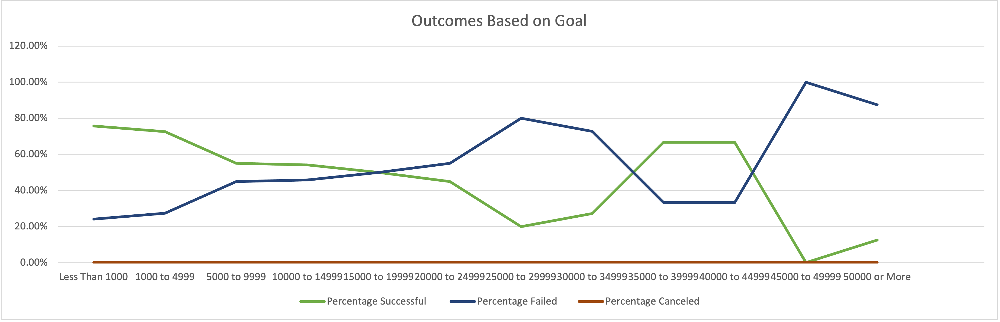

# Kickstarting with Excel

## Overview of Project

This projects deals with helping our customer 'Louise' on analyzing data related to campaign kickstarters. Louise recently organized a play and it came close to its fundraising goals. In this project we analyzed and vaizualized how different campaigns compared in relation to their launch dates and their funding goals. 

### Purpose

The purpose of this project is to enhance our Excel skills and take a deeper dive into the material we have covered this previous week in class.

## Analysis and Challenges

### Analysis of Outcomes Based on Launch Date

For our first analysis, we compared theater outcomes by launch date. For this we created a new column in our Kickstarter sheet and utilized the Year() formula. This formaula extracts the year from the "Date Conversion" column". Then, we created a Pivot Table of the Kickstarter sheet for easy querying of the data present.

### Theater Outcomes Based on Launch Date

            
            

### Analysis of Outcomes Based on Goals

For our second analysis, we compared outcomes based on goals. We created a new data set and utilized the =CountIfs() function to populate the number of successful, failed, and canceled plays based on their intial goals. We then populated the Total Projects column using the =Sum() function and calculated their respective percentages.

 

### Challenges and Difficulties Encountered

One challenge I faced, while completing this analysis, was crafting the formula for the =COUNTIFS () function. I wasn't sure at first how to use this function on multiple rows of data and how to ensure the correct data is populating. After creating a dummy sheet, with less data, i was able to practice with this function a little more and see how it's filtering through each column. Breaking large sets of data down into smaller sets helps me focus more on the formulas and not so much on the data that's populating because it's easier to find and ensure that data is correct

## Results

- What are two conclusions you can draw about the Outcomes based on Launch Date?
* Subcategories related to theater are more likely to be successfully during the summer months/warmer weather months (April- August)
*Subcategories related to theater are more likely to fail or be canceled when launched in December. 

- What can you conclude about the Outcomes based on Goals?

*Goals above 40000 have a 25% chance of being successful 

- What are some limitations of this dataset?

* We are not sure how this data was captured or filtered.

- What are some other possible tables and/or graphs that we could create?

One other table we could create is a conversion table that could show how much each category made in their countries or a differents currency. 

